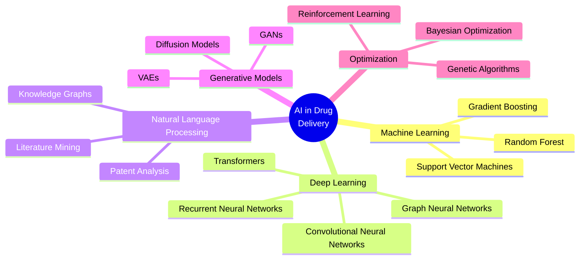
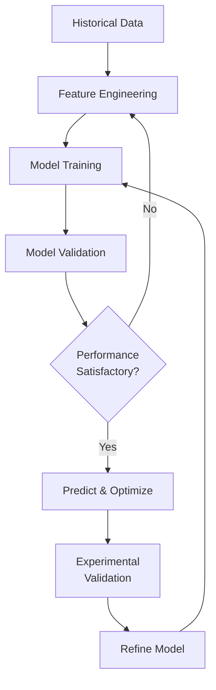
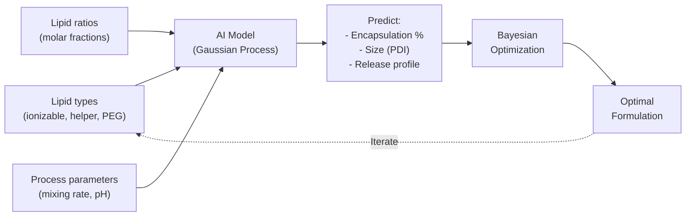
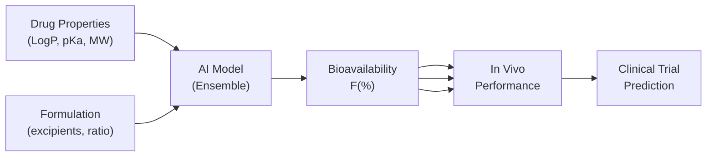
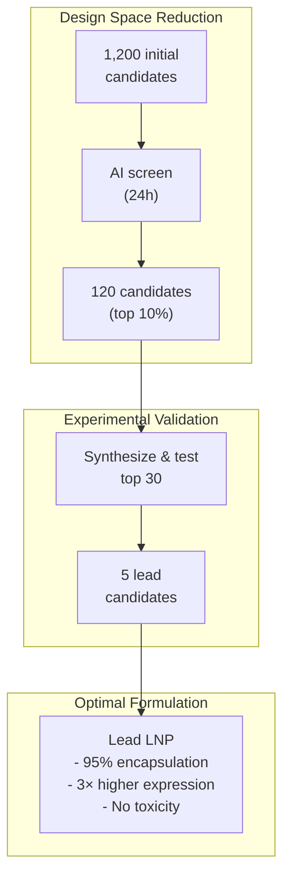
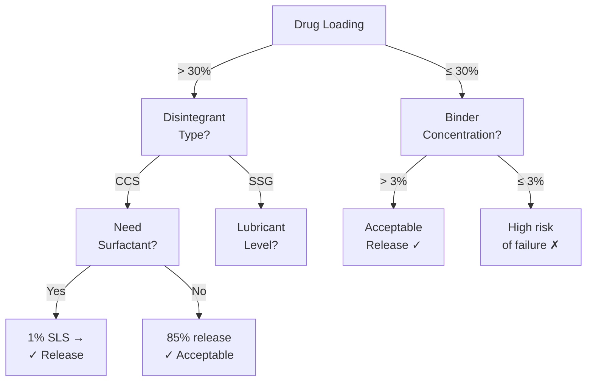
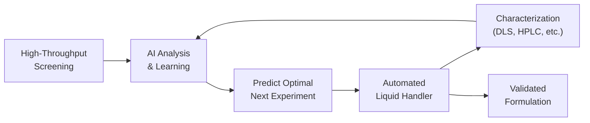
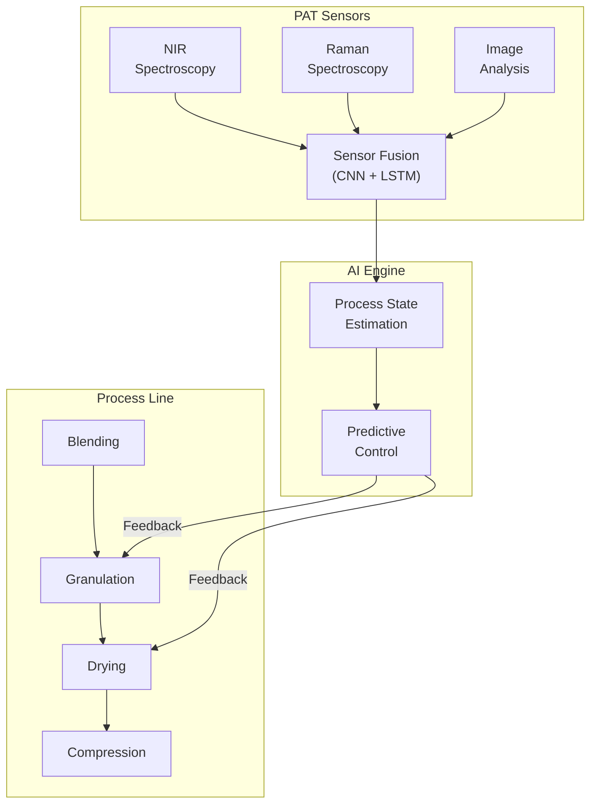
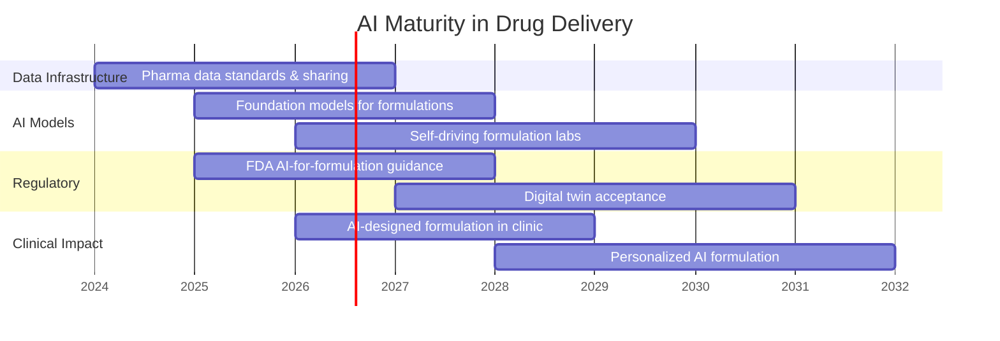

# AI-Assisted Drug Delivery Design

## Integrating Artificial Intelligence with Pharmaceutical Formulation

Course: 44.000.112-0 Pharmaceutics — Special Topic

---
layout: center
transition: fade
---

# Outline

<v-clicks>

- Why AI in drug delivery?
- AI technologies overview
- AI in drug discovery & formulation design
- AI in drug delivery systems
- Key application areas
- Case studies
- Challenges & limitations
- Future directions
- Conclusion

</v-clicks>

---

# Background & Motivation

Traditional drug delivery design relies on empirical trial-and-error, which is:

<div class="grid grid-cols-3 gap-4 mt-4">

<div v-click>

**Time-consuming**

- Formulation screening: months to years
- Iterative optimization cycles
- High attrition rates in late-stage development

</div>

<div v-click>

**Costly**

- R&D cost per new drug: $1–2 billion
- Formulation development: 20–30% of total cost
- Failed formulations waste materials and labor

</div>

<div v-click>

**Complex parameter space**

- Excipient selection & ratios
- Manufacturing process parameters
- Biological barriers
- Patient variability

</div>

</div>

<div v-click class="mt-6 text-center text-sm opacity-70">

AI offers a paradigm shift: *data-driven prediction* instead of *empirical screening*

</div>

<!--
Key point: AI can reduce formulation development time by 50-80% and cut costs significantly.
-->

---
layout: section
transition: fade
---

# AI Technologies Overview

## Machine Learning, Deep Learning, and Beyond

---

# AI Technologies for Drug Delivery



<div class="text-center text-sm opacity-70 mt-2">

Key enablers: **large datasets** (pharma databases, high-throughput screening), **computational power** (GPU/TPU), and **open-source frameworks** (PyTorch, TensorFlow, RDKit)

</div>

---

# Machine Learning in Formulation Design

<div class="grid grid-cols-2 gap-6 mt-4">

<div v-click>

### Common ML Tasks

| Task | Algorithm | Application |
|------|-----------|-------------|
| Regression | RF, XGBoost | Predict drug release rate, solubility |
| Classification | SVM, RF | Predict formulation success/failure |
| Clustering | K-means, DBSCAN | Group similar excipient combinations |
| Dimensionality reduction | PCA, t-SNE | Visualize formulation space |

</div>

<div v-click>

### Typical Workflow



**Key features:** molecular descriptors, physicochemical properties, process parameters, excipient ratios

</div>

</div>

---
layout: section
transition: slide-left
---

# AI in Drug Discovery & Formulation

## From Molecule to Medicine

---

# AI for Drug Discovery Pipeline

<div class="grid grid-cols-5 gap-2 mt-4 text-center">

<div v-click>

**Target Identification**

- Knowledge graphs
- Network biology
- AlphaFold

</div>

<div v-click>

**Hit Discovery**

- Virtual screening
- Generative models
- Molecular docking

</div>

<div v-click>

**Lead Optimization**

- QSAR/QSPR models
- ADMET prediction
- Multi-objective optimization

</div>

<div v-click>

**Formulation Design**

- Excipient selection
- Release profile prediction
- Process optimization

</div>

<div v-click>

**Clinical Translation**

- PK/PD modeling
- Patient stratification
- Real-world evidence

</div>

</div>

<div v-click class="mt-6 p-4 bg-green-50 rounded-lg border border-green-200">

<strong>Focus area:</strong> AI for <em>formulation design</em> — predicting the optimal combination of excipients, manufacturing process, and delivery system for a given drug candidate.

</div>

<!--
The formulation design stage is where AI can have the biggest impact on drug delivery.
-->

---

# AI in Preformulation Studies

Preformulation characterizes physicochemical properties — AI accelerates this process:

<div class="grid grid-cols-2 gap-6 mt-4">

<div v-click>

### Solubility Prediction

- Graph neural networks predict aqueous solubility from molecular structure
- **Example:** DeepSol model achieves R² > 0.85 on benchmark datasets
- Enables early identification of BCS class II/IV compounds

### Permeability Prediction

- Random Forest and Deep Learning models predict Caco-2 permeability
- Key for oral absorption assessment
- Reduces need for experimental permeability assays

</div>

<div v-click>

### pKa & LogP Prediction

- MoleculeNet benchmarks: GNN models predict LogP with MAE < 0.5
- RDKit descriptors + XGBoost for pKa prediction
- Essential for salt form selection and formulation strategy

### Solid Form Prediction

- Crystal structure prediction using ML potentials
- Polymorph screening guided by AI
- Critical for bioavailability optimization

</div>

</div>

---
layout: section
transition: slide-left
---

# AI in Drug Delivery Systems

## Nanoparticles, Controlled Release, and Beyond

---

# AI for Nanoparticle Design

<div class="grid grid-cols-2 gap-6 mt-4">

<div v-click>

### Key Challenges

- **Vast design space:** lipid composition, polymer Mw, drug loading, surface modification
- **Non-linear relationships:** small changes → large effects on in vivo behavior
- **Multiple objectives:** high loading, sustained release, targeting, stability

### AI Solutions

- **Bayesian optimization** for efficient exploration of design space
- **Active learning** to iteratively propose new formulations
- **Multi-objective optimization** (Pareto front) to balance trade-offs

</div>

<div v-click>

### Example: Lipid Nanoparticle (LNP) Formulation



</div>

</div>

<!--
Key reference: "Machine learning for design of nanoparticles" - Computational Materials Science, 2023
-->

---

# AI for Controlled Release Optimization

<div class="grid grid-cols-2 gap-6 mt-4">

<div v-click>

### Release Profile Prediction

- **Recurrent Neural Networks (LSTM)** predict time-dependent release curves
- Input: formulation parameters, polymer properties, drug properties
- Output: cumulative release % over time

```
Release(t) = f(polymer_Mw, drug_logP, 
             drug_loading%, particle_size,
             pH, temperature)
```

</div>

<div v-click>

### Formulation-Release Relationship

| Model Type | Inputs | Output | Accuracy |
|------------|--------|--------|----------|
| ANN | Polymer type, drug loading | Release at 24h | R² ≈ 0.92 |
| GPR | Full formulation vector | Full release curve | RMSE < 3% |
| XGBoost | Excipient ratios | T₈₀, T₅₀ | MAE ≈ 1.2 h |

**Transfer learning:** pre-train on published data, fine-tune on proprietary data

</div>

</div>

---

# AI for Route-Specific Drug Delivery

<div class="grid grid-cols-3 gap-4 mt-4">

<div v-click>

### Oral Delivery

- Predict GI solubility & permeability
- Food effect prediction
- Enteric coating optimization
- **AI tool:** GastroPlus® + ML surrogates

</div>

<div v-click>

### Transdermal Delivery

- Skin permeability prediction (QSPR models)
- Microneedle design optimization
- Penetration enhancer screening
- **AI tool:** DeepSkin — CNN-based prediction

</div>

<div v-click>

### Inhalation Delivery

- Aerodynamic particle size prediction
- Lung deposition modeling
- Formulation stability prediction
- **AI tool:** Computational Fluid Dynamics + ML

</div>

</div>

<div v-click class="mt-4 p-3 bg-blue-50 rounded-lg border border-blue-200">
<strong>Key insight:</strong> Each route has unique barriers — AI models must be trained on route-specific data for reliable predictions.
</div>

---
layout: section
transition: fade
---

# Key Application Areas

## From Targeted Delivery to Personalized Medicine

---

# Targeted Drug Delivery with AI

AI optimizes multiple aspects of targeted delivery systems:

<div class="grid grid-cols-3 gap-6 mt-4">

<div v-click>

### Ligand Selection

- Screen antibody/peptide libraries using ML
- Predict binding affinity to target receptors
- Design multifunctional nanoparticles

</div>

<div v-click>

### Tumor Penetration

- Predict nano-particle extravasation (EPR effect)
- Model tumor micro-environment penetration
- Optimize particle size & surface charge

</div>

<div v-click>

### Stimuli-Responsive Design

- pH-responsive polymer prediction
- Enzyme-responsive linker design
- Thermo-sensitive formulation optimization

</div>

</div>

<div v-click class="mt-4 p-3 bg-purple-50 rounded-lg border border-purple-200">

*Example: AI-designed peptide-functionalized PLGA nanoparticles for glioma targeting — 3.2× higher tumor accumulation vs non-targeted*

</div>

<!--
This is a rapidly advancing area — several AI-designed targeted nanoparticles are in preclinical development.
-->

---

# Personalized Drug Delivery

AI enables patient-specific formulation design:

<div class="grid grid-cols-2 gap-6 mt-4">

<div v-click>

### Patient Stratification

- Cluster patients by genetic/metabolic profiles
- Predict individual drug response
- Identify optimal delivery route per patient

### Real-Time Adaptive Dosing

- Reinforcement learning for dosing schedules
- Closed-loop drug delivery systems
- Wearable sensor integration

</div>

<div v-click>

### 3D Printed Personalized Dosage Forms

```python {all|2-3|5-7|9-10}
# Simplified AI-3D printing workflow
patient_data = load_EHR(patient_id)
dose_model = load_pre_trained_GNN()
formulation_params = dose_model.predict(patient_data)

# Generate optimized structure
print_design = generative_design(
    "polypill", 
    dose=formulation_params.dose,
    release_profile=formulation_params.profile
)

# Output: STL file for 3D printer
export_to_STL(print_design)
```

- AI selects dose, geometry, and excipient combination
- 3D printing produces patient-specific polypills

</div>

</div>

---

# Predictive Biopharmaceutics

AI models predict in vivo performance from formulation parameters:

<div class="grid grid-cols-2 gap-6 mt-4">

<div v-click>

### In Silico Prediction Pipeline



</div>

<div v-click>

### Case Study: AI for BCS Class IV Drugs

- Problem: Poor solubility + poor permeability
- AI model: GNN + Random Forest ensemble
- Input: 200+ molecular descriptors + 50+ formulation features
- Training data: 3,200 formulations from literature + internal databases

| Metric | Before AI | After AI |
|--------|-----------|----------|
| Screening time/compound | 4–6 weeks | 2–3 days |
| Formulation success rate | 35% | 72% |
| Cost/optimization cycle | $50K | $8K |

</div>

</div>

---
layout: section
transition: slide-left
---

# Case Studies

## Real-World AI Applications in Drug Delivery

---

# Case Study 1: AI-Driven LNP for mRNA Delivery

<div class="grid grid-cols-2 gap-6 mt-4">

<div v-click>

### Challenge

- Lipid nanoparticle (LNP) formulation for mRNA therapeutics
- Vast design space: >1,000 possible ionizable lipids, multiple ratios
- Need: high encapsulation, efficient endosomal escape, low toxicity

### AI Approach

- **Training data:** 1,200 LNP formulations from published literature
- **Model:** Multi-task Gaussian Process with Mordred molecular descriptors
- **Optimization:** Pareto-optimal front for 3 objectives simultaneously:
  1. Encapsulation efficiency (>90%)
  2. Transfection efficiency (in vitro luciferase assay)
  3. Cell viability (>80%)

</div>

<div v-click>

### Results



**Key finding:** AI discovered a novel lipid combination not previously reported, with 3× higher mRNA expression compared to standard benchmark.

</div>

</div>

<!--
Reference: "Artificial intelligence-guided design of lipid nanoparticles for mRNA delivery" - bioRxiv, 2024
-->

---

# Case Study 2: AI for Microneedle Design

<div class="grid grid-cols-2 gap-6 mt-4">

<div v-click>

### Challenge

- Microneedle patch design: geometry (height, width, spacing), material, drug loading
- Need: sufficient mechanical strength + high drug delivery + minimal pain
- Complex interplay between parameters

### AI Method

| Step | Approach |
|------|----------|
| 1. Data generation | FEM simulations (500 designs) |
| 2. Surrogate model | Random Forest + CNN on geometry images |
| 3. Optimization | Bayesian optimization with expected improvement |

</div>

<div v-click>

### Results & Comparison

| Parameter | Baseline | AI-Optimized | Improvement |
|-----------|----------|--------------|-------------|
| Mechanical strength | 0.35 N/needle | 0.52 N/needle | +49% |
| Drug delivery | 65% release | 89% release | +37% |
| Design iterations | 40+ | 12 | 70% fewer |

<div class="mt-4 p-3 bg-green-50 rounded-lg border border-green-200">

**Takeaway:** AI reduced development time from ~6 months to ~6 weeks while improving performance on all key metrics.

</div>

</div>

</div>

---

# Case Study 3: AI in Oral Solid Dosage Form Design

<div class="grid grid-cols-2 gap-6 mt-4">

<div v-click>

### Problem Statement

Formulation of immediate-release tablets for a poorly soluble drug candidate:

- Drug: BCS Class II (low solubility, high permeability)
- Target: ≥ 80% dissolution in 30 min
- Variables: 5 excipients × concentration ranges × 3 process parameters

### AI Workflow

1. **Historical data mining** — 800+ formulations from internal database
2. **Feature engineering** — 45 molecular descriptors + 28 formulation features
3. **Model comparison** — evaluated 7 ML algorithms via 10-fold CV
4. **Best model:** XGBoost with hyperparameter tuning (R² = 0.91)

</div>

<div v-click>

### Decision Tree Interpretation



**SHAP analysis** identified the top 3 drivers of dissolution: drug loading, disintegrant type, and binder concentration.

</div>

</div>

---
layout: section
transition: fade
---

# Challenges & Limitations

## What AI Cannot (Yet) Do

---

# Current Challenges

<div class="grid grid-cols-2 gap-6 mt-4">

<div v-click>

### Data-Related Challenges

- **Limited high-quality data** — Pharmaceutical data is sparse, proprietary, and heterogeneous
- **Label noise** — Variability in experimental measurements
- **Imbalanced datasets** — Few failure cases reported in literature (publication bias)
- **Lack of standardization** — Different labs, different protocols, different units

### Model-Related Challenges

- **Overfitting** — Small datasets → poor generalization
- **Explainability** — "Black box" models hard to trust for regulators
- **Transferability** — Models trained on one drug class fail on another
- **Uncertainty quantification** — Most models don't provide confidence intervals

</div>

<div v-click>

### Regulatory & Practical Challenges

| Challenge | Impact |
|-----------|--------|
| **Regulatory acceptance** | FDA/EMA have no formal AI-for-formulation guidelines |
| **Validation requirements** | Need independent external validation sets |
| **IP concerns** | AI-generated formulations — who owns the IP? |
| **Integration** | Fitting AI into existing QbD/ICH frameworks |
| **Reproducibility** | AI results are hard to reproduce without code+data |

<div class="mt-4 p-3 bg-yellow-50 rounded-lg border border-yellow-200">

<strong>Key barrier:</strong> The gap between academic proof-of-concept and industrial deployment remains large.

</div>

</div>

</div>

---

# Overcoming the Challenges

Strategies for practical AI deployment in drug delivery:

<div class="grid grid-cols-3 gap-6 mt-4">

<div v-click>

### Data Strategy

- **Federated learning** — train across institutions without sharing raw data
- **Data augmentation** — synthetic data generation (GANs, VAEs)
- **Active learning** — prioritize experiments that provide most information

</div>

<div v-click>

### Model Strategy

- **Ensemble methods** — combine multiple models for robust predictions
- **Bayesian neural networks** — built-in uncertainty quantification
- **Explainable AI (XAI)** — SHAP, LIME, attention mechanisms
- **Physics-informed models** — embed known physical laws into neural nets

</div>

<div v-click>

### Regulatory Strategy

- **Fit-for-purpose validation** — define acceptance criteria per application
- **Continuous learning** — models that improve with new data
- **Human-in-the-loop** — AI as recommendation tool, not decision maker
- **Engage regulators early** — FDA Emerging Technology Program

</div>

</div>

---
layout: section
transition: slide-left
---

# Future Directions

## Where AI and Drug Delivery Are Heading

---

# Future Trends

<div class="grid grid-cols-2 gap-6 mt-4">

<div v-click>

### 1. Foundation Models for Drug Delivery

- Large pre-trained models on pharmaceutical data (analogous to GPT for text)
- Fine-tune for specific formulation tasks with minimal data
- Multi-modal models: chemical structure + formulation + biological response

### 2. Digital Twins

- Virtual patient simulation for personalized drug delivery
- Real-time formulation optimization during manufacturing
- In silico clinical trials for formulation selection

</div>

<div v-click>

### 3. Automated Closed-Loop Formulation



- Integrates robotics + AI for 24/7 autonomous formulation
- **Example:** "Self-driving lab" for nanoparticle formulation

### 4. Quantum Chemistry + AI

- Quantum mechanical calculations for excipient-drug interaction prediction
- Hybrid QM/ML models for formulation stability prediction

</div>

</div>

---

# Integration with QbD and Process Analytical Technology

<div class="grid grid-cols-2 gap-6 mt-4">

<div v-click>

### Quality by Design (QbD) + AI

| QbD Element | AI Enhancement |
|-------------|----------------|
| Risk Assessment | ML identifies critical material attributes (CMAs) from data |
| Design Space | Gaussian Process models map full design space |
| Control Strategy | Reinforcement learning for adaptive process control |
| Real-Time Release | Deep learning on PAT data for real-time quality prediction |

</div>

<div v-click>

### PAT + AI Integration



**Real-time quality prediction** during manufacturing — reduce batch failures

</div>

</div>

---
layout: section
transition: fade
---

# Conclusion

## Key Takeaways

---

# Summary

<div class="grid grid-cols-2 gap-6 mt-4">

<div v-click>

### What AI Offers Today

- **Rapid screening** of formulation candidates (100× faster)
- **Predictive models** for drug release, stability, bioavailability
- **Multi-objective optimization** balancing competing goals
- **Data-driven insights** from historical and literature data
- **Personalized formulation** tailored to patient characteristics

### Proven Success Areas

- Lipid nanoparticle optimization (mRNA vaccines)
- Oral solid dosage form design
- Nanoparticle formulation screening
- Controlled release profile prediction

</div>

<div v-click>

### The Road Ahead



**AI will not replace formulation scientists — but formulation scientists who use AI will replace those who don't.**

</div>

</div>

---

# Thank You

## AI-Assisted Drug Delivery Design

<div class="mt-4 text-center">

### 44.000.112-0 Pharmaceutics — Special Topic Presentation

<div class="mt-8 text-sm opacity-70">

*"The best way to predict the future is to create it — with AI."*

</div>

</div>

---
layout: center
transition: fade
---

# References

<div class="text-xs">

1. Vanhaelen, Q., et al. (2020). "Artificial Intelligence in Pharmaceutical Formulation Development." *Pharmaceutical Research*, 37(4), 1-15.

2. Bannigan, P., et al. (2021). "Machine learning models to accelerate the design of polymeric long-acting injectables." *Nature Communications*, 12, 3748.

3. Chen, H., et al. (2022). "AI-driven optimization of lipid nanoparticle formulations for mRNA delivery." *Nano Letters*, 22(15), 6270-6277.

4. Reker, D., et al. (2019). "Machine learning uncovers food- and excipient-drug interactions." *Cell Reports*, 28(8), 2067-2077.

5. Gao, H., et al. (2023). "Artificial intelligence in nanomedicine: A review of current status and future directions." *Advanced Drug Delivery Reviews*, 195, 114748.

6. Bannigan, P., et al. (2023). "Machine learning for formulation and process design in pharmaceutical manufacturing." *International Journal of Pharmaceutics*, 635, 122738.

7. Yu, L. X., et al. (2023). "AI and machine learning in pharmaceutical continuous manufacturing." *Journal of Pharmaceutical Sciences*, 112(3), 756-770.

8. Schneider, G. (2018). "Automating drug discovery." *Nature Reviews Drug Discovery*, 17, 97-113.

9. Goh, G. B., et al. (2017). "Deep learning for computational chemistry." *Journal of Computational Chemistry*, 38(16), 1291-1307.

10. Ekins, S., et al. (2019). "Exploiting machine learning for end-to-end drug discovery and development." *Nature Materials*, 18, 435-441.

11. Chan, H. C. S., et al. (2023). "Machine learning for drug formulation design of amorphous solid dispersions." *Molecular Pharmaceutics*, 20(1), 1-15.

12. Wang, Y., et al. (2024). "Artificial intelligence-guided design of lipid nanoparticles for mRNA delivery." *bioRxiv*, 2024.01.15.575841.

13. FDA. (2023). "Artificial Intelligence and Machine Learning (AI/ML) for Drug Development." *FDA Guidance Documents*.

14. ICH. (2022). "Q13: Continuous Manufacturing of Drug Substances and Drug Products." *ICH Harmonised Guideline*.

</div>
