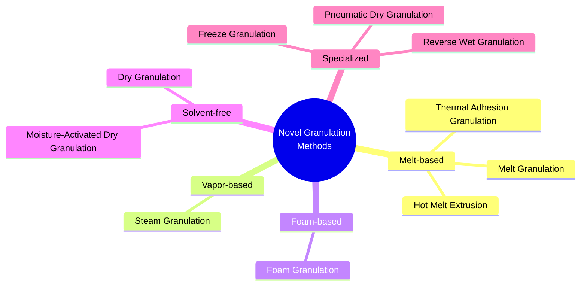
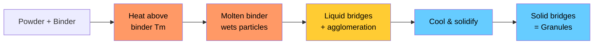
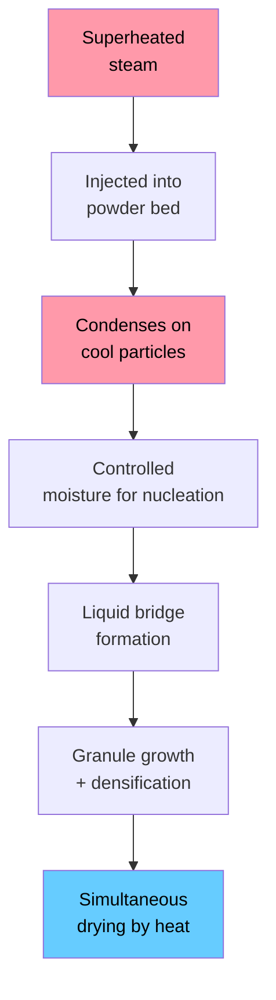
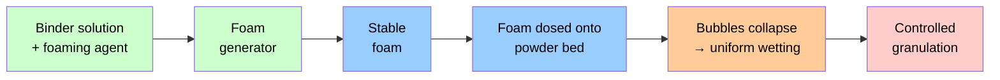

# Novel Granulation Methods

## Basic Principles and Advantages

Course: 44.000.112-0 Pharmaceutics — Week 3 Assignment

---
layout: center
transition: fade
---

# Outline

<v-clicks>

- Why novel granulation methods?
- Overview of novel granulation technologies
- **Melt Granulation** — principles & advantages
- **Steam Granulation** — principles & advantages
- **Foam Granulation** — principles & advantages
- Comparison summary
- Conclusion

</v-clicks>

---

# Limitations of Conventional Wet Granulation

Conventional wet granulation remains the gold standard, but has well-known drawbacks:

**Process limitations**

- Multi-step process (wet massing → drying → milling)
- **High energy consumption** during drying phase
- Long processing times (batch-to-batch variability)
- Complex scale-up from lab to production

**Product limitations**

- **Unsuitable for moisture-sensitive APIs** — hydrolysis or degradation
- Unsuitable for heat-sensitive drugs when drying requires elevated temperatures
- Risk of over-wetting → poor granule properties
- Solvent use for water-insoluble drugs (environmental concerns)

These limitations drive the development of *novel granulation methods* that address specific gaps.

<!--
Key point: Novel methods aren't meant to replace wet granulation entirely, but to solve specific problems like moisture sensitivity, heat sensitivity, and energy efficiency.
-->

---
layout: section
transition: fade
---

# Novel Granulation Technologies

## An Overview

---

# Overview of Novel Granulation Methods

This presentation focuses on three innovative methods: <strong>Melt</strong>, <strong>Steam</strong>, and <strong>Foam</strong> granulation.

---
layout: section
transition: slide-left
---

# Melt Granulation

## Principles & Advantages

---

# Melt Granulation: Basic Principles

Melt granulation uses a **molten binder** (instead of water or solvent) to agglomerate powder particles.

### Process Steps

1. **Blending** — Powder mixture + meltable binder (PEG, waxes, stearic acid) are blended
2. **Heating** — Temperature raised above binder's melting point (typically 50–100 °C)
3. **Agglomeration** — Molten binder wets particle surfaces; capillary forces and viscous flow form liquid bridges
4. **Cooling** — Binder solidifies → **solid bridges** bind particles into granules

**Common binders:** PEG 3000–20000, poloxamers, stearic acid, glyceryl behenate, carnauba wax, hydrogenated castor oil

---

# Melt Granulation: Equipment & Process Variables

Two main equipment platforms are used:

### High-Shear Melt Granulation

- Powder blended in high-shear mixer with **jacketed vessel** for heating
- Impeller speed and chopper speed control granule growth
- **Variables:** binder content, impeller speed, mixing time, cooling rate
- Granules are denser and less porous

### Fluidized Bed Melt Granulation

- Warm air fluidizes powder bed; binder sprayed as melt or pre-blended as solid
- **More uniform** temperature distribution
- **Variables:** inlet air temperature, atomization air pressure, spray rate
- Granules are more porous and have better redispersibility

> **Key thermodynamic requirement:** Process temperature must be > binder $T_m$ but <  drug degradation temperature. The binder should be molten throughout the agglomeration phase.

---

# Melt Granulation: Advantages

### ✅ Key Advantages

- **No water or organic solvents** → ideal for moisture-sensitive APIs (e.g., aspirin, certain antibiotics)
- **No drying step required** → eliminates the most energy-intensive phase of conventional granulation, reducing processing time by up to **40–50%**
- **Suitable for heat-sensitive materials** when using low-melting-point binders (e.g., PEG 4000, $T_m$ ≈ 55 °C)
- **Controlled-release capability** — hydrophobic/waxy binders (carnauba wax, glyceryl behenate) provide sustained release profiles
- **Improved granule strength** due to solidified binder bridges
- **Single-step process** in suitable equipment

### ⚠ Limitations

- Limited to binders with suitable melting ranges (typically 50–100 °C)
- Potential thermal degradation of APIs if processing temperature isn't carefully controlled
- Drug-binder **compatibility** must be verified (drug may dissolve in molten binder, affecting release)
- Binder distribution uniformity can be challenging
- Not ideal for very high-dose formulations (binder % may be too high)

**Key advantage:** Melt granulation is particularly attractive for **moisture-sensitive drugs** and for formulations requiring **controlled release**, where conventional wet granulation would fail or require additional coating steps.

---

# Melt Granulation: Applications

### Pharmaceutical Applications

| Application | Example | Binder Used |
|-------------|---------|-------------|
| Moisture-sensitive APIs | Aspirin, Omeprazole | PEG 6000 |
| Controlled release | Theophylline SR | Glyceryl behenate |
| Taste masking | Paracetamol | PEG + Eudragit |
| Solubility enhancement | Griseofulvin | Poloxamer 188 |
| Immediate release | Ibuprofen | PEG 4000 |

### Comparison: Melt vs Conventional Wet Granulation

| Aspect | Melt Granulation | Wet Granulation |
|--------|-----------------|-----------------|
| Processing time | 15–30 min + cooling | 45–90 min + drying |
| Energy consumption | Lower (no drying) | Higher (drying) |
| Moisture-sensitive APIs | Suitable | Not suitable |
| Equipment complexity | Moderate (needs heating) | Standard |
| Scale-up | Challenging | Well-established |

---
layout: section
transition: slide-left
---

# Steam Granulation

## Principles & Advantages

---

# Steam Granulation: Basic Principles

Steam granulation uses **superheated steam** as the binder liquid instead of liquid water.

### Mechanism

1. **Steam injection** — Superheated steam (100–150 °C) is injected into the powder bed
2. **Condensation** — Steam condenses on cooler powder particles, providing controlled moisture for nucleation
3. **Agglomeration** — Condensed water forms liquid bridges; particles coalesce
4. **Drying** — The heat from the steam and the fluidizing air simultaneously evaporate excess moisture

The process relies on the **heat transfer** from steam to powder, controlling the amount of condensate formed.

**Equipment:** High-shear granulators or fluidized bed granulators with steam injection ports, typically retrofitted.

---

# Steam Granulation: Advantages

### ✅ Key Advantages

- **Reduced liquid volume** — steam distributes more uniformly and efficiently than sprayed water (up to **30–50% less water** added)
- **Faster, more uniform binder distribution** — steam penetrates the powder bed more evenly than liquid spray
- **Shorter drying time** — less water to remove; the heat of the steam contributes to evaporation
- **Lower energy consumption** compared to conventional wet granulation (combines granulation and initial drying in one step)
- **More porous granules** with better compressibility and disintegration properties

### ⚠ Limitations

- Potential thermal degradation if steam temperature is too high
- Requires **specialized equipment** (steam generator, injection system, condensation control)
- **Condensation control** is critical — too much leads to over-wetting, too little to under-granulation
- Not suitable for thermolabile drugs without extensive optimization
- Less established in industrial practice vs conventional methods

**Notable benefit:** Steam granulation yields granules with **higher porosity** and **better compressibility** compared to conventional wet granulation — this translates to tablets with faster disintegration and improved dissolution.

---
layout: section
transition: slide-left
---

# Foam Granulation

## Principles & Advantages

---

# Foam Granulation: Basic Principles

Foam granulation introduces the binder solution as a **foam** rather than as sprayed liquid droplets.

### Mechanism

1. **Foam preparation** — Binder solution (PVP, HPMC, starch) mixed with a foaming agent, then passed through a **foam generator**
2. **Foam dosing** — Stable foam is dosed onto the powder bed in a high-shear or fluidized bed granulator
3. **Foam collapse** — Foam bubbles break upon contact with powder, releasing binder liquid in a highly uniform manner
4. **Granulation** — Uniform liquid distribution leads to controlled nucleation and granule growth

**Key insight:** Foam occupies a much larger volume per unit mass of liquid — so less water achieves more uniform distribution.

---

# Foam Granulation: Advantages

### ✅ Key Advantages

- **Significantly reduced water requirement** — foam's high volume-to-liquid ratio means **30–50% less water** needed for uniform distribution
- **More uniform binder distribution** — foam disperses across the powder bed more evenly than spray nozzles, reducing local over-wetting
- **Shorter drying time** due to less added water
- **Reduced risk of over-wetting** and uncontrolled agglomeration
- **Less sensitivity to process parameters** — spray rate, droplet size, nozzle placement become less critical
- **Suitable for moisture-sensitive drugs** due to reduced water content

### ⚠ Limitations

- Requires **additional equipment** (foam generator) → added capital cost
- Requires a pharmaceutically acceptable **foaming agent** (e.g., polysorbates)
- **Foam stability** must be carefully controlled — too stable → slow collapse; too unstable → behaves like conventional spray
- Relatively newer technology → less industrial track record
- May require formulation re-optimization when switching from conventional wet granulation

**Key differentiator:** Foam granulation is **less sensitive to scale-up** than conventional wet granulation. Since foam distribution doesn't depend on nozzle geometry or spray pattern, transfer from lab to production is significantly simpler.

---

# Comparison Summary

| Feature | Melt Granulation | Steam Granulation | Foam Granulation |
|---------|:----------------:|:-----------------:|:----------------:|
| **Binding agent** | Molten solid binder | Steam (water vapor) | Foamed liquid binder |
| **Drying step?** | ❌ No | ✅ Yes (shorter) | ✅ Yes (shorter) |
| **Water added?** | ❌ None | Low (condensed) | Low (as foam) |
| **Moisture-sensitive APIs** | ⭐ Excellent | Good | Good |
| **Energy consumption** | Low | Moderate | Moderate |
| **Equipment complexity** | Moderate | Moderate-High | Moderate |
| **Maturity** | Established | Emerging | Emerging |
| **Key strength** | Eliminates drying; SR possible | Uniform moisture distribution | Scale-up simplicity |

---
layout: center
transition: fade
---

# Conclusion

<v-clicks>

**Conventional wet granulation** has inherent limitations — moisture sensitivity, energy-intensive drying, and scale-up complexity.

**Melt granulation** eliminates the drying step entirely by using molten binders, making it ideal for moisture-sensitive APIs and controlled-release formulations.

**Steam granulation** uses superheated steam for more uniform moisture distribution with reduced water volume and energy consumption.

**Foam granulation** delivers binder as a foam, achieving uniform distribution with less water and simpler scale-up.

**Bottom line:** The choice depends on the API properties, desired granule characteristics, and available equipment — each method fills a specific gap in the granulation toolbox.

</v-clicks>

---
layout: end
transition: fade
---

# Thank You

### 44.000.112-0 Pharmaceutics — Week 3 Assignment

---

# References

<v-clicks>

1. Vadaga, S. S., et al. (2024). Comprehensive review on modern techniques of granulation in pharmaceutical solid dosage forms. *Intelligent Pharmacy*, 2(5), 660–674.
2. Shanmugam, S. (2015). Granulation techniques and technologies: recent progresses. *BioImpacts*, 5(1), 55–63.
3. Gherman, S., et al. (2020). Melt granulation: A review of recent advances. *Drug Development and Industrial Pharmacy*, 46(8), 1205–1219.
4. Walker, G. M., et al. (2007). Steam granulation — processing and characterization. *Chemical Engineering Journal*, 127(1–3), 91–98.
5. Keleb, E. I., et al. (2001). Foam granulation — a novel approach. *Pharmaceutical Technology*, 25(9), 44–54.
6. €lbicki, J., & Mendyk, A. (2021). Foam granulation — current status and future directions. *Pharmaceutics*, 13(9), 1380.
7. Pouton, C. W. (2000). Lipid formulations for oral administration of drugs. *European Journal of Pharmaceutical Sciences*, 11, S93–S98.

</v-clicks>

---
layout: default
transition: fade
class: text-sm
---

# Appendix: LaTeX — Free Energy of Granulation

For conventional wet granulation, the work required to form liquid bridges can be expressed as:

$$
\Delta G_{\text{gran}} = \gamma_{LV} \Delta A - T\Delta S
$$

where $\gamma_{LV}$ is the liquid-vapor interfacial tension, $\Delta A$ is the increase in surface area, and $\Delta S$ is the entropy change upon binder distribution.

**Melt granulation** replaces $\gamma_{LV}$ with $\gamma_{SL}$ (solid-liquid interfacial tension of the molten binder), and the energy balance includes the latent heat of solidification:

$$
Q_{\text{solidification}} = m_{\text{binder}} \cdot \Delta H_f
$$

where $\Delta H_f$ is the enthalpy of fusion of the binder. This heat is released during cooling and contributes to the mechanical strength of the final granules.
